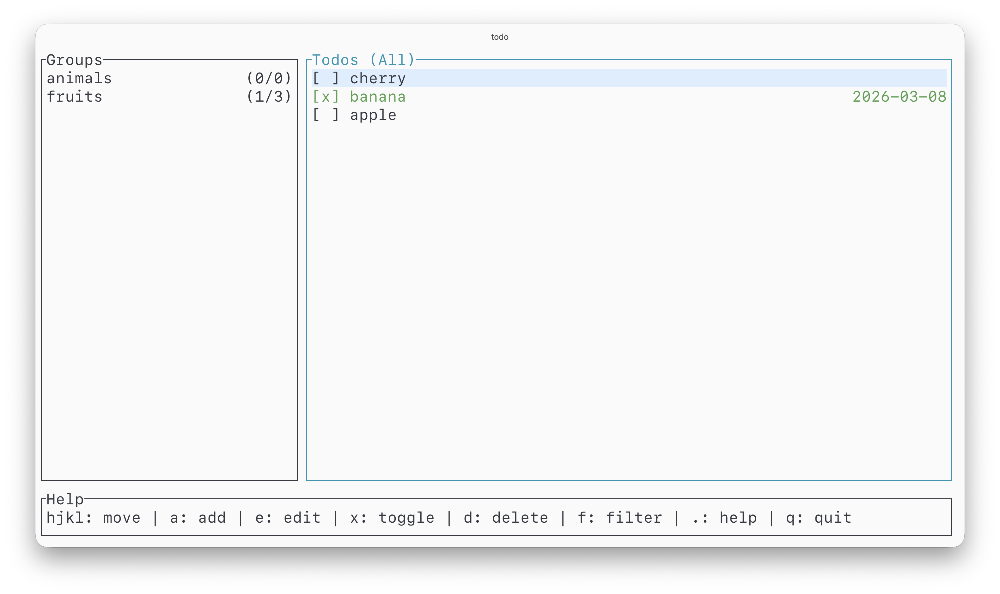

# Simple Todo TUI (Rust)

## Screenshot



## Installation

1. Download the binary file. ([releases](https://github.com/wdyjwdy/simple-todo-tui/releases))
2. Place it in your `bin` directory, for example: `~/mybin/todo`.
3. Add the directory to your environment variables in `~/.zshrc`. (Optional)

    ```
    export PATH="$HOME/mybin:$PATH"
    ```

4. Then run

    ```bash
    todo
    ```

## Keybindings

- `h` / `←`: focus group panel
- `l` / `→`: focus todo panel
- `j` / `↓`: move down in focused panel
- `k` / `↑`: move up in focused panel
- `a`: add in focused panel (group or todo)
- `e`: edit in focused panel (group or todo)
- `d`: delete in focused panel (group or todo, with confirm)
- `x` / `⏎`: toggle selected todo complete (todo panel only)
- `f`: cycle filter (`all` -> `open` -> `done`) for focused panel
  - Todos: filter todo items by status
  - Groups: `all` shows all groups, `open` shows groups with `x < y`, `done` shows groups with `x = y` where `x/y` is completed/total
- `.`: toggle help panel
- `Enter`: confirm in modal (add/edit/delete)
- `Esc`: cancel current modal
- `←` / `→` / `Home` / `End`: move cursor in add/edit input
- `q`: quit

## Data file location

By default, todos are stored in:

- macOS: `~/Library/Application Support/simple-todo-tui/todos.json`
- Linux: `$XDG_DATA_HOME/simple-todo-tui/todos.json` (or fallback under `~/.local/share/...`)
- Fallback (if no platform data dir): `./todos.json`
